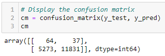

# Credit Risk Analysis - Module 18 Challenge
UNC Chapel Hill Data Analytics Bootcamp

## Overview of Project
For Module 18, Imbalanced-learn, Scikit-learn, and Python were used in Jupyter Notebook to perform supervised machine learning on a credit risk dataset. The data was oversampled using the `RandomOverSampler` and `SMOTE` algorithms, undersampled using the `ClusterCentroids` algorith, and a combination of over- and undersampling using the `SMOTEENN` algorithm. The results of the derived models were then compared to two ensemble learners, `BalancedRandomForestClassifier` and `EasyEnsembleClassifier`, to examine the performance of each type of supervised machine learning.

## Method & Results
### Use Resampling Models to Predict Credit Risk
The dataset was imported and cleaned, then split into training and testing sets. Three resampling models were used: Imbalanced-learn's `RandomOverSampler` and `SMOTE` models for oversampling, and Imbalanced-learn's `ClusterCentroids` for undersampling. The logistic regression model was trained with each sampling method, and the balaced accuracy score, confusion matrix, and imbalanced classification reports were displayed.

<b>RandomOverSampler:</b>

  
Balanced accuracy score

  
  
  

  
Confusion matrix

  
  
   Top row: true positives, false positives 
  Bottom row: false negatives, true negatives
  

  
Imbalanced classification report

  
  
   pre = precision, rec = recall, spe = specificity, f1 = f1-score, geo = geometric mean, iba = index-balanced accuracy, sup = support
  

<b>SMOTE:</b>

  
Balanced accuracy score

  
  
  

  
Confusion matrix

  
  
   Top row: true positives, false positives 
  Bottom row: false negatives, true negatives
  

  
Imbalanced classification report

  
  
   pre = precision, rec = recall, spe = specificity, f1 = f1-score, geo = geometric mean, iba = index-balanced accuracy, sup = support
  

<b>ClusterCentroids:</b>

  
Balanced accuracy score

  
  
  

  
Confusion matrix

  
  
   Top row: true positives, false positives 
  Bottom row: false negatives, true negatives
  

  
Imbalanced classification report

  
  
   pre = precision, rec = recall, spe = specificity, f1 = f1-score, geo = geometric mean, iba = index-balanced accuracy, sup = support
  

### Use the SMOTEENN Algorithm to Predict Credit Risk
Using the same training and testing data as the steps above, the training data was resampled with combination sampling - that is, both over- and undersampling, then used to train a logistic regression model.

  
Balanced accuracy score

  
  
  

  
Confusion matrix

  
  
   Top row: true positives, false positives 
  Bottom row: false negatives, true negatives
  

  
Imbalanced classification report

  
  
   pre = precision, rec = recall, spe = specificity, f1 = f1-score, geo = geometric mean, iba = index-balanced accuracy, sup = support
  

### Use Ensemble Classifiers to Predict Credit Risk
The dataset is again loaded, cleaned, and split into training and testing sets. The data was trained using Imbalanced-learn's `BalancedRandomForestClassifier` and `EasyEnsembleClassifier`, and each method's balanced accuracy score, confusion matrix, and imbalanced classification report was published.

<b>BalancedRandomForestClassifier:</b>

  
Balanced accuracy score

  
  
  

  
Confusion matrix

  
  
   Top row: true positives, false positives 
  Bottom row: false negatives, true negatives
  

  
Imbalanced classification report

  
  
   pre = precision, rec = recall, spe = specificity, f1 = f1-score, geo = geometric mean, iba = index-balanced accuracy, sup = support
  

<b>EasyEnsembleClassifier:</b>

  
Balanced accuracy score

  
  
  

  
Confusion matrix

  
  
   Top row: true positives, false positives 
  Bottom row: false negatives, true negatives
  

  
Imbalanced classification report

  
  
   pre = precision, rec = recall, spe = specificity, f1 = f1-score, geo = geometric mean, iba = index-balanced accuracy, sup = support
  

## Summary
Based on the accuracy results from the above resampling and ensemble classifier methods, the Easy Ensemble Classifier proved to have the most positive results. With a 0.93 balanced accuracy (with 1 being perfectly accurate), it far outshone the competition, with the next highest being the Balanced Random Forest Classifier at 0.79. The Easy Ensemble Classifier also had similar or better scores than other methods throughout its imbalanced classification report.
